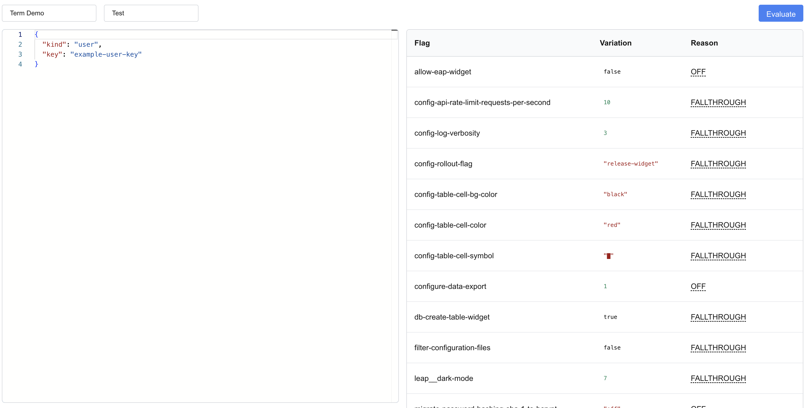

# LaunchDarkly Context Tester



A Next.js application that allows you to test LaunchDarkly feature flag evaluations with different contexts. This tool provides a real-time interface for evaluating feature flags across different environments and projects.

## Features

- Interactive JSON context editor
- Real-time flag evaluation
- Detailed evaluation reasons with tooltips
- Support for all LaunchDarkly context types
- OAuth authentication with LaunchDarkly

## Prerequisites

- Node.js (v16 or later)
- npm or yarn
- A LaunchDarkly account with admin access
- mkcert (for local HTTPS development)

## Setup

1. Clone the repository:
   ```bash
   git clone <your-repo-url>
   cd ld-context-test
   ```

2. Install dependencies:
   ```bash
   npm install
   # or
   yarn install
   ```

3. Create a `.env.local` file in the root directory with the following variables:
   ```
   NEXTAUTH_URL=https://localhost:3000
   NEXTAUTH_SECRET=<your-random-secret>
   
   LAUNCHDARKLY_CLIENT_ID=<your-oauth-client-id>
   LAUNCHDARKLY_CLIENT_SECRET=<your-oauth-client-secret>
   LAUNCHDARKLY_REDIRECT_URI=http://localhost:3000/api/auth/callback/launchdarkly
   ```

   Note: The `LAUNCHDARKLY_REDIRECT_URI` should match the redirect URI you configured in your LaunchDarkly OAuth application settings.

## Setting up LaunchDarkly OAuth

1. Create an OAuth application using the LaunchDarkly API:
   ```bash
   curl -X POST https://app.launchdarkly.com/api/v2/oauth/clients \
     -H "Authorization: Bearer $LAUNCHDARKLY_API_KEY" \
     -H "Content-Type: application/json" \
     -d '{
       "name": "Context Tester",
       "redirectUri": "http://localhost:3000/api/auth/callback/launchdarkly", 
       "description": "OAuth client for testing LaunchDarkly contexts"
     }' | tee launchdarkly-oauth-client.json
   ```

Note: You can't use http for the redirect URI, so you'll need to setup https locally or use ngrok to get a public URL.

## Running the Application

1. Start the development server with HTTPS:
   ```bash
   # If using npm
   npm run dev 

   # If using yarn
   yarn dev 
   ```

2. Open [https://localhost:3000](https://localhost:3000) in your browser
   - You may need to accept the self-signed certificate warning on first visit
3. Log in with your LaunchDarkly account
4. Select a project and environment
5. Start testing contexts!

## Usage

1. The left panel contains a JSON editor where you can input your context
2. The right panel shows the evaluation results including:
   - Flag key
   - Evaluated variation
   - Evaluation reason with detailed tooltips
3. Click "Evaluate" to test your context
4. Hover over evaluation reasons to see detailed explanations

## Default Context

The application provides a default context:
```json
{
  "kind": "user",
  "key": "example-user-key"
}
```

You can modify this to test different context types and attributes.

## Contributing

Contributions are welcome! Please feel free to submit a Pull Request.

## License

This project is licensed under the Apache 2.0 license. See the [LICENSE](LICENSE) file for details.